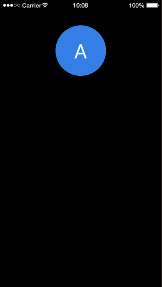
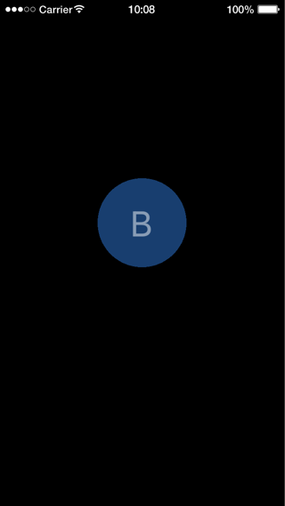

# dmc-objects

Object-oriented classes for Solar2D (formerly Corona SDK): write your game objects as classes that you can move, animate and listen to like display objects.

A class wraps a display group, and instances work with `transition.to()`, `x`/`y`, `insert()` and event listeners:

```lua
local Objects = require 'dmc_corona.dmc_objects'

local Ship = Objects.newClass( Objects.ComponentBase, { name="Ship" } )

function Ship:__createView__()
	self:superCall( '__createView__' )
	--==--
	self:insert( display.newImageRect( 'ship.png', 64, 64 ) )
end

local ship = Ship:new()
transition.to( ship, { time=500, x=200, alpha=0.5 } )
```

## Features

- Classes with `newClass()`, multiple inheritance and mixins, built on [lua-objects](https://github.com/dmccuskey/lua-objects)
- A component base class backed by a display group: instances have `x`, `y`, `alpha`, `rotation`, `insert()`, `toFront()`, ... and work with transitions
- A physics base class that adds the physics body properties and methods (`setLinearVelocity()`, `applyForce()`, ...)
- A set construction and teardown order: hooks for properties, display objects and listeners, undone in reverse by `removeSelf()`
- Getters and setters: `obj.speed = 45` can run your code
- `superCall()` to reach any method of a parent class
- Events: `addEventListener()` and `dispatchEvent()`, Solar2D-style or with a type and data
- `isa()`, `is_class`, `is_instance` and a printable class name
- `optimize()` copies inherited methods onto an object for faster lookups
- Pure Lua, no plugins; MIT licensed

## Quick Start

The following code will get you up and running in about 10 minutes in the Solar2D Simulator on macOS or Windows. It writes a class, creates an instance of it, moves it and removes it.

Prerequisites: the [Solar2D](https://solar2d.com/) Simulator and a copy of this repository (`git clone https://github.com/dmccuskey/dmc-objects.git`, or download the ZIP from GitHub).

### 1. Copy the Library into Your Project

Copy these from this repository into the root of your project folder:

```text
dmc_corona_boot.lua     loader for the DMC libraries
dmc_corona.cfg          configuration
dmc_corona/             dmc-objects and the libraries it uses
```

**Going further:** keep the libraries in a subfolder, or combine several DMC libraries ([dmc-corona-boot Configuration](https://github.com/dmccuskey/dmc-corona-boot/blob/master/docs/configuration.md)).

### 2. Write a Class

Create `badge.lua` in the project folder, a class for a round badge with a label:

```lua
local Objects = require 'dmc_corona.dmc_objects'

local Badge = Objects.newClass( Objects.ComponentBase, { name="Badge" } )

-- properties
function Badge:__init__( params )
	params = params or {}
	self:superCall( '__init__', params )
	--==--
	self._label = params.label or '?'
	self._circle = nil
	self._text = nil
end

-- display objects
function Badge:__createView__()
	self:superCall( '__createView__' )
	--==--
	self._circle = display.newCircle( 0, 0, 100 )
	self._circle:setFillColor( 0.2, 0.5, 0.9 )
	self:insert( self._circle )

	self._text = display.newText( self._label, 0, 0, native.systemFont, 80 )
	self:insert( self._text )
end

function Badge:__undoCreateView__()
	self._text:removeSelf()
	self._text = nil
	self._circle:removeSelf()
	self._circle = nil
	--==--
	self:superCall( '__undoCreateView__' )
end

-- a property with a getter and a setter
function Badge.__getters:label()
	return self._label
end
function Badge.__setters:label( value )
	self._label = value
	self._text.text = value
end

return Badge
```

Then create `main.lua` with:

```lua
local Badge = require 'badge'

local badge = Badge:new{ label='A' }
badge.x, badge.y = display.contentCenterX, 200

print( badge, badge:isa( Badge ), badge.label )
```

Open the project in the Simulator. A blue badge labeled "A" appears at the top of the screen, and the console shows:

```text
Badge (table: 0x600001a2c040)	true	A
```

If it shows `module 'dmc_corona.dmc_objects' not found` instead, `dmc_corona/` is missing from the root of the project folder. `The module 'lib.dmc_lua.lua_objects' not found` means `dmc_corona.cfg` is missing there.

**Going further:** what each hook is for, and how to lay out a class file ([Writing Classes](docs/writing-classes.md)).

### 3. Move It and Remove It

Add this to the end of `main.lua`:

```lua
transition.to( badge, { time=1000, y=500, alpha=0.5 } )
badge.label = 'B'

badge:addEventListener( 'tap', function()
	badge:removeSelf()
	print( 'removed' )
end )
```

The Simulator restarts the app when the file is saved. The badge now reads "B" and slides down while it fades to half transparent:

 

Click it: it disappears and the console shows `removed`. `removeSelf()` ran `__undoCreateView__()`, which removed the circle and the text.

**Going further:** send your own events from a class ([Events](docs/writing-classes.md#events)), or see complete apps in [examples](examples/).

To update, copy `dmc_corona_boot.lua` and `dmc_corona/` again from the newer version. Keep your own `dmc_corona.cfg` if you have changed it.

## Documentation

- [Writing Classes](docs/writing-classes.md): the class file layout, the construction and teardown hooks, events, speed
- [API reference](docs/api.md): `newClass()`, the component and physics classes, what they forward to the display group, known issues
- [Examples](examples/): five apps, including two Solar2D samples rewritten as classes
- [Changelog](CHANGELOG.md)

Everything else is listed on the [documentation home](docs/README.md).

## License

dmc-objects is released under the [MIT License](LICENSE).
