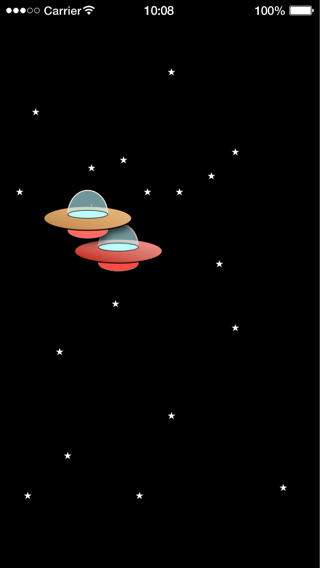
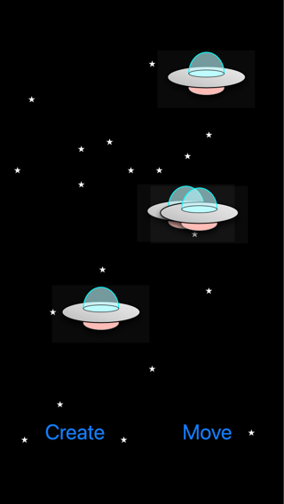
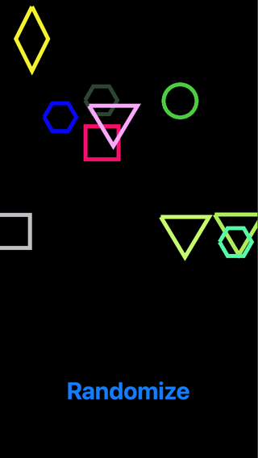
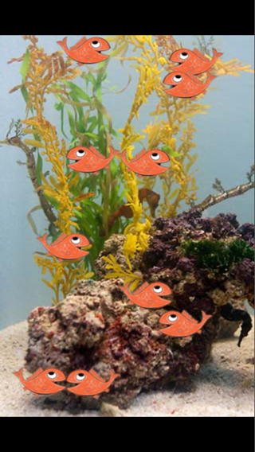
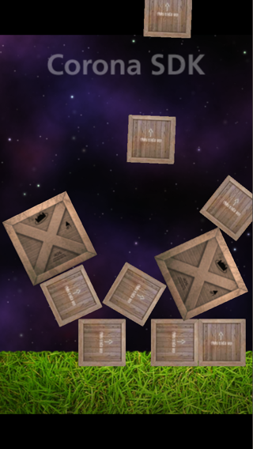

# Examples

Each folder is a complete Solar2D project with its own copy of the library: open its `main.lua` in the Solar2D Simulator. [Writing Classes](../docs/writing-classes.md) explains the class structure they use.

| | |
|---|---|
|  | **DMC-ufo**: UFOs fly around the screen and change color with their speed; the faster they go, the "hotter" the ship. A small, complete class: the construction and teardown hooks, an `enterFrame` listener, timers and transitions. |
|  | **DMC-Arch-ufo2**: create UFOs, send them to random places, and tap one to remove it. The class sends its own event when it is tapped, and `main.lua` listens for it. (Screenshot after pressing Create four times.) |
|  | **DMC-MultiShapes**: press the button and shapes are drawn at random places. Several levels of inheritance (a `Shape` class and its subclasses), and a factory that creates the shapes. |
|  | **Corona-Graphics-Fishies**: the Corona SDK sample `Graphics/Fishies` rewritten with classes. The variable names and logic are kept, so you can compare it with the original. |
|  | **Corona-Physics-ManyCrates**: the Corona SDK sample `Physics/ManyCrates` rewritten with classes: crates of three sizes inheriting from one base class, added to the physics engine. |
